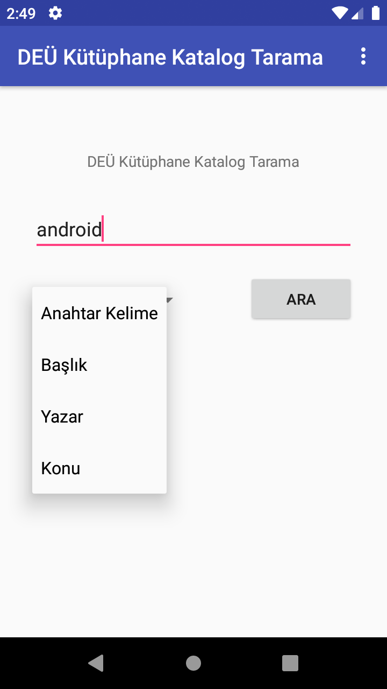
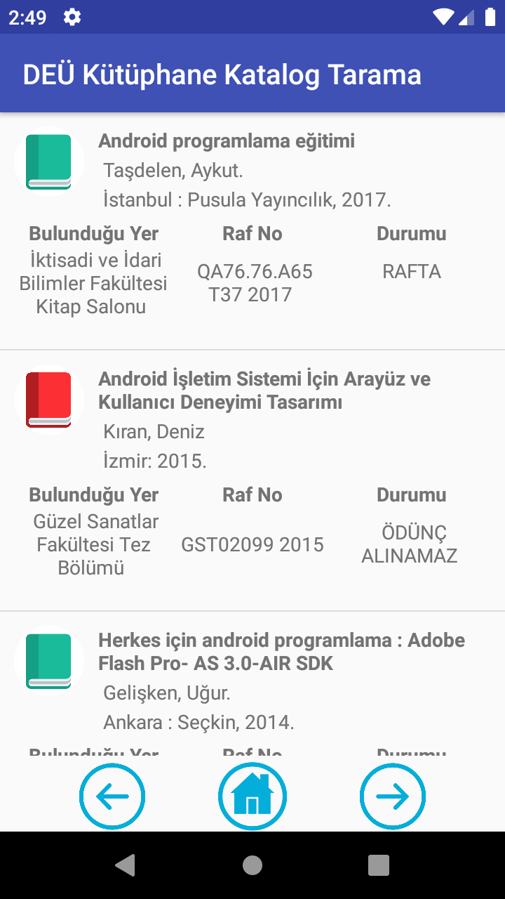
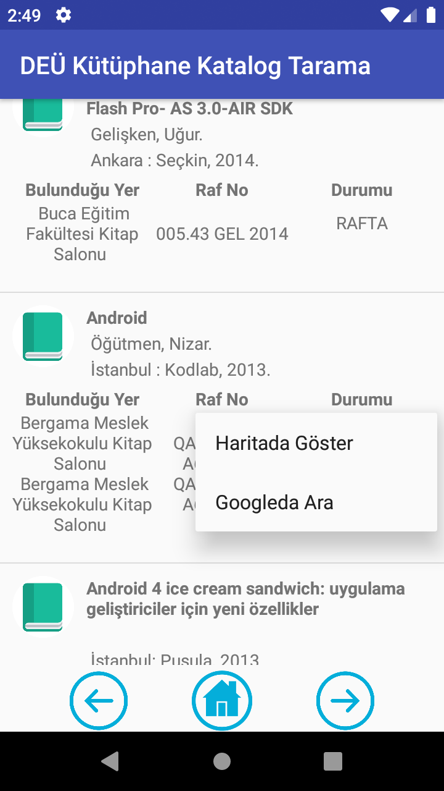
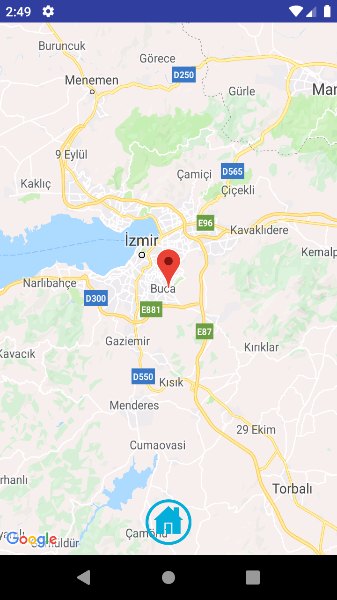

# DEUKutuphaneKatalogTarama
Dokuz Eylül Üniversitesi kütüphane kataloğunu taramaya yarayan bir mobil uygulama

2018 Yılında ilk yapmış olduğumuz mobil projelerden olan bu proje ile okulumuzun tüm kütüphanelerindeki kitapları, kitapların durumunu,
kitapların bulunduğu kütüphanelerin yerlerini harita üzerinde görebilmemize yardımcı mobil uygulama. 
Anahtar kelime, başlık, yazar adı, konu filtreleri ile kitap aratabilirsiniz.

Aynı zamanda kitapların bulunan kitapların isimlerini google'da aratabilir hakkında daha fazla bilgi edinebilirsiniz.

